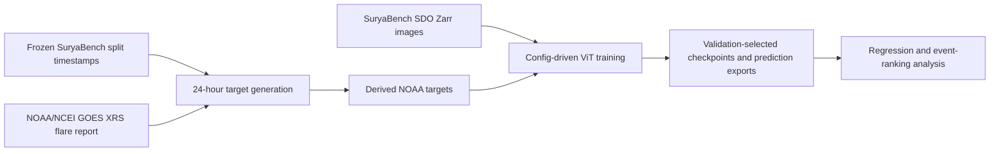

# rxfi-benchmark

> A benchmark for 24-hour solar-flare forecasting with Relative X-ray Flux Increase (RXFI).

`rxfi-benchmark` evaluates NOAA/NCEI-derived absolute and background-relative flare targets from frozen SuryaBench SDO image splits. It is a research repository for controlled target-representation and input-channel comparisons, not a production forecasting service.

## Overview

Forecasting the largest forthcoming GOES soft-X-ray peak captures absolute flare magnitude, but not its increase above the pre-flare X-ray background. RXFI adds that relative perspective. The benchmark holds image inputs, temporal splits, and model settings fixed while comparing what can be learned from SDO observations and how predicted continuous scores rank conventional severe-flare windows.

## RXFI

For an eligible NOAA flare-report event,

$$
\operatorname{RXFI}=\frac{F_{\mathrm{peak}}-F_{\mathrm{background}}}{F_{\mathrm{background}}}.
$$

$F_{\mathrm{peak}}$ is the one-minute GOES XRS-B peak irradiance (`xrsb_irrad`) and $F_{\mathrm{background}}$ is NOAA's event-specific pre-flare background irradiance (`background_irrad`), both in W m$^{-2}$. RXFI is dimensionless; for example, RXFI = 4 means the peak is five times the recorded background. Missing, non-finite, or non-positive inputs are invalid for RXFI calculations.

The implemented 24-hour targets are `max_peak_flux`, `cumulative_peak_flux`, `max_rxfi`, and `cumulative_rxfi`. Maximum and cumulative forms distinguish the dominant eligible event from total activity in a forecast window.

## Benchmark at a glance

| Component | Implemented setting |
| --- | --- |
| Forecast window | Half-open future interval $[t, t + 24\ \mathrm{h})$ |
| Event source | NOAA/NCEI Level-2 GOES XRS Flare Report |
| Image input | SuryaBench 13-channel, 224$\times$224 SDO Zarr images |
| Model family | Randomly initialized `vit_small_patch16_224` |
| Classification target | NOAA-derived `max_flare_class`, ordinal `FQ/A/B/C/M/X` |
| Regression targets | Maximum/cumulative peak flux and maximum/cumulative RXFI |
| Quantile regression | q05/q50/q95 with pinball loss |
| Split policy | Frozen temporal train, validation, test, and diagnostic leaky-validation splits |

## Benchmark pipeline



## Dataset and label construction

For each immutable split timestamp $t$, the generator aggregates eligible flare peaks in $[t,t+24\ \mathrm{h})$. `max_peak_flux` and `cumulative_peak_flux` use valid positive XRS-B peaks; `max_rxfi` and `cumulative_rxfi` use valid event-level RXFI values. `max_flare_class` is the NOAA class of the maximum-peak event; a no-event window is `FQ`. Ties are resolved by earliest peak time, then stable event identifier.

The corrected ordinal classifier uses this explicit fixed mapping:

| Band | Index |
| --- | ---: |
| `FQ` | 0 |
| `A` | 1 |
| `B` | 2 |
| `C` | 3 |
| `M` | 4 |
| `X` | 5 |

The implementation maps values such as `B3.4` and `M2.1` to their bands and rejects malformed labels. The currently audited usable cohorts contain no A-band examples, but A remains in the six-band vocabulary. The original exact-magnitude classifier is retained only for provenance; use the `_ordinal6` configurations for ordinal experiments.

See the [target-generation specification](docs/research/24h_target_generation.md) and [NOAA XRS/RXFI definition](docs/research/noaa_xrs_catalog_and_rxfi_definition.md) for quality rules, no-flare handling, and catalog caveats.

## Implemented experimental settings

| Family | Target(s) | Controlled comparison |
| --- | --- | --- |
| Project 1 QR | Four peak-flux/RXFI targets | Same 13-channel input, ViT-Small/16, resolution, quantiles, optimizer, seed, and validation-pinball selection rule |
| Project 2 classification | Ordinal `max_flare_class` | `hmi_m`, `aia131`, `aia193`, and `all13`; validation macro-F1 selection |
| Project 2 QR | `cumulative_peak_flux` | The same four input conditions; validation pinball-loss selection |

Project 1 transforms are `log10(max_peak_flux / 1e-8)`, `log10(1 + cumulative_peak_flux / 1e-8)`, `log10(1 + max_rxfi)`, and `log10(1 + cumulative_rxfi)`.

## Repository structure

```text
rxfi-benchmark/
├── configs/          # YAML experiment configurations
├── data/             # local derived targets and raw caches (gitignored)
├── docs/research/    # specifications and research notes
├── scripts/          # generation, training, analysis, and Slurm launchers
├── tests/            # focused implementation checks
├── environment.yml   # Conda environment
└── LICENSE           # Apache-2.0 license
```

## Installation

The checked-in Conda environment specifies Python 3.11.16, PyTorch 2.5.1 CUDA 12.4 wheels, `timm`, `zarr`, and `scikit-learn`.

```bash
git clone git@github.com:JinsuHongg/rxfi-benchmark.git
cd rxfi-benchmark
conda env create -f environment.yml
conda activate rxfi-benchmark
```

The repository does not distribute the SuryaBench Zarr store, frozen split CSVs, derived target CSVs, or NOAA catalog files. Point the selected YAML configuration at authorized local copies.

## Quick start

Generate targets from immutable splits and a local NOAA flare-report CSV:

```bash
python scripts/generate_24h_targets.py \
  --data-dir /path/to/index_data \
  --noaa-csv /path/to/noaa_flare_report.csv \
  --derived-dir data/derived
```

Validate transforms without training:

```bash
python scripts/train_vit_quantile_regression.py \
  --config configs/vit_small_224_max_peak_flux_qr.yaml \
  --validate-transforms
```

After the YAML paths resolve and a CUDA GPU is available, run a representative QR experiment:

```bash
python scripts/train_vit_quantile_regression.py \
  --config configs/vit_small_224_cumulative_peak_flux_qr.yaml
```

The scripts require CUDA. Cluster launchers are at [scripts/run_all_qr_experiments.sh](scripts/run_all_qr_experiments.sh), [scripts/project2/run_project2_preliminary.sh](scripts/project2/run_project2_preliminary.sh), and [scripts/project2/slurm/](scripts/project2/slurm/).

## Configuration and evaluation

YAML files define data paths, target transform or representation, selected channels, model, image size, seed, and output directory. Training supports `--batch-size`, `--precision` (`32`, `16-mixed`, `bf16-mixed`), `--num-workers`, and `--gradient-accumulation-steps` overrides.

Classification reports accuracy, balanced accuracy, macro-F1, class-wise precision/recall/F1, and a test confusion matrix. Quantile regression reports per-quantile pinball loss, q50 errors, empirical quantile frequencies, and crossing rates. The Project 1 analysis additionally uses transformed-space Spearman correlation, $R^2$, MAE/IQR, and q50-based M+/X+ AUROC/AUPRC.

## Current benchmark status

> [!NOTE]
> This repository is under active research development. Benchmark definitions, preprocessing, and experimental settings may evolve.

- **Implemented:** NOAA/XRS target construction, the frozen RXFI definition, ViT-Small classification and QR pipelines, and Project 2 channel-comparison configurations.
- **Documented results:** the controlled Project 1 four-target QR analysis is available in the [predictability and event-relevance report](docs/research/four_qr_target_predictability_and_event_relevance.md).
- **Classification caution:** original Project 2 outputs used exact NOAA magnitude strings; the [ordinal-label audit](docs/research/project2_classification_label_audit.md) documents the corrected six-band configurations.
- **TBD:** a fixed OCQR calibration/evaluation procedure is not implemented.

## Results

The documented Project 1 QR comparison uses the same 27,980-row test cohort for all four targets. It separates learnability from severe-event relevance and does not establish a globally optimal physical target.

| Target | Spearman | MAE / IQR | M+ AUPRC | X+ AUPRC |
| --- | ---: | ---: | ---: | ---: |
| Maximum peak flux | 0.826 | 0.244 | 0.655 | 0.093 |
| Cumulative peak flux | 0.859 | 0.247 | 0.715 | 0.148 |
| Maximum RXFI | 0.509 | 0.481 | 0.613 | 0.108 |
| Cumulative RXFI | 0.576 | 0.402 | 0.581 | 0.095 |

See the [four-target QR report](docs/research/four_qr_target_predictability_and_event_relevance.md) for $R^2$, no-skill AUPRC baselines, quantile diagnostics, and limitations.

## Reproducibility

Training records resolved configurations, source-split hashes, row-alignment checks, selected channels, cohort availability, seed, GPU/runtime metadata, learning logs, checkpoint metadata, and prediction exports. Frozen split hashes are checked before training; test data are not used for checkpoint selection. Temporal split rules are documented in the [RXFI distribution and imbalance analysis](docs/research/rxfi_distribution_and_imbalance_analysis.md).

## Documentation

- [NOAA XRS catalog and RXFI definition](docs/research/noaa_xrs_catalog_and_rxfi_definition.md)
- [Deterministic 24-hour target generation](docs/research/24h_target_generation.md)
- [Four-target ViT-Small quantile regression](docs/research/vit_small_224_four_target_quantile_regression.md)
- [Project 2 preliminary multichannel experiment](docs/research/project2_preliminary_multichannel_experiment.md)
- [Current research state](docs/research/current_state.md)

## Citation

Citation information will be added when the associated paper becomes available.

## License

This code is released under the [Apache License 2.0](LICENSE). Users are responsible for complying with the terms of external data providers.

## Acknowledgments

Flare targets use the NOAA/NCEI GOES XRS Flare Report. See the [catalog specification](docs/research/noaa_xrs_catalog_and_rxfi_definition.md) for provenance and caveats.
