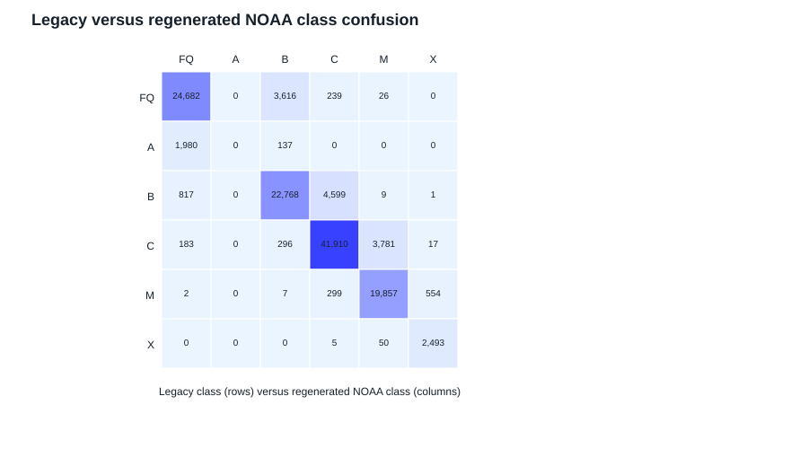
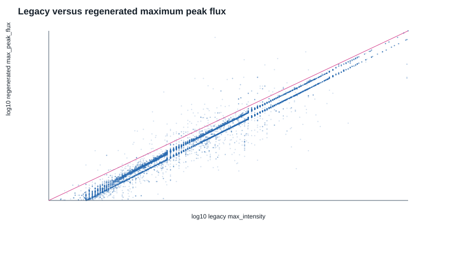
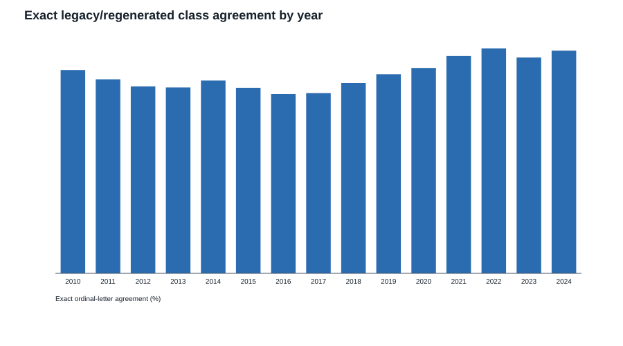

# Historical GOES Label Mismatch Audit

## Purpose and frozen constraints

This audit diagnoses the apparent disagreement between historical `max_goes_class` labels and regenerated NOAA science-quality `max_flare_class` before ML work begins. All source splits, the confirmed `[t, t + 24h)` contract, generated target logic, and frozen RXFI formula were read only. No split membership, label, target definition, or test protocol was changed.

The audit uses the generated target files solely as read-only inputs. Original-split SHA-256 hashes remain unchanged, and every derived target file retains its source row count, order, and timestamp.

## Legacy label inventory

Each split has six legacy fields: `timestamp`, `max_goes_class`, `cumulative_index`, `label_max`, `label_cum`, and `max_intensity`. The only continuous legacy maximum-flux proxy is `max_intensity`. The split files contain no flare identifier, flare peak/start time, satellite/source field, or 24-hour label-generation metadata. No legacy label-generation code or documentation was found in the repository or supplied data directory.

Consequently, exact legacy event identity cannot be established. `max_intensity` is used as a continuous-flux proxy only, not as proof that the same event was selected.

## Main findings

The previously reported 15–21% historical agreement required exact class-string equality, including the numeric suffix (for example, `B2.8` versus `B3.7`). This audit separately evaluates conventional ordinal letter agreement using the actual observed order `FQ < A < B < C < M < X`.

| Split | Exact ordinal-letter agreement | Adjacent disagreement | Severe disagreement (distance >=2) |
| --- | ---: | ---: | ---: |
| Train | 82.97% | 11.88% | 5.16% |
| Validation | 79.74% | 15.44% | 4.82% |
| Test | 95.12% | 3.40% | 1.48% |
| Leaky validation | 83.45% | 12.57% | 3.98% |

Thus, the major source of the initially low exact-string agreement is numeric class-string difference within the same conventional letter class, rather than widespread movement across B/C/M/X categories. This does not by itself prove a particular calibration mechanism, but it directly rules out interpreting the 15–21% figure as only 15–21% broad-class agreement.

## Class confusion and ordinal distance

The full raw and row-normalized matrices are in [class_confusion_raw.csv](../../outputs/historical_label_mismatch_audit/class_confusion_raw.csv) and [class_confusion_row_normalized.csv](../../outputs/historical_label_mismatch_audit/class_confusion_row_normalized.csv).

Adjacent shifts are concentrated in weak events: legacy A always maps one ordinal level upward because the NOAA report does not generally retain an A-class maximum event in these windows, and legacy B has 20.8–26.9% adjacent shifts in historical splits. C/M/X have much higher broad-class agreement. Severe distance is dominated by `FQ`/flare inclusion differences; because A is present in the observed rank order, `FQ -> B` has ordinal distance two.

## Continuous peak-flux comparison

`max_intensity` is available in every split and is comparable to regenerated `max_peak_flux` only as a proxy. On rows where both are positive, log10-flux correlations are very high:

| Split | Comparable rows | Pearson | Spearman | Median absolute log10 difference |
| --- | ---: | ---: | ---: | ---: |
| Train | 57,345 | 0.9901 | 0.9902 | 0.1578 |
| Validation | 3,044 | 0.9889 | 0.9890 | 0.1571 |
| Test | 35,505 | 0.9873 | 0.9844 | 0.0069 |
| Leaky validation | 4,770 | 0.9939 | 0.9934 | 0.1585 |

The historical median absolute log difference of about 0.158 corresponds to a factor of about 1.44, while the test median is close to one-to-one. This is evidence for a systematic historical continuous-flux scale/version difference; it is not evidence of pervasive arbitrary event selection.

The figure uses log10 axes and includes a 1:1 reference. It uses a deterministic display subsample; table statistics use all comparable rows.

## Event selection and timing audit

The regenerated targets use exactly the confirmed half-open peak-time window `[t, t + 24h)`. The target-generation script asserts exclusion of an event exactly at `t + 24h`.

Legacy event IDs or times are absent, so the audit cannot count “same selected event” versus “different selected event.” Every legacy event is **not identifiable**, not silently inferred. Similarly, the search found no legacy label-generation code or documentation that could support an alternative endpoint convention, timestamp shift, daily grouping, or start-time inclusion rule. Therefore, there is no evidence in the available artifacts for a timing-convention mismatch; it remains untestable rather than excluded absolutely.

## Evidence-supported categories

The audit classifies observed outcomes, not unproven mechanisms:

- `same_ordinal_class`: broad conventional letter agrees; this includes numeric-string differences such as `B2.8` versus `B3.7`.
- `adjacent_ordinal_class_shift`: letter moves by one rank.
- `no_flare_flare_inclusion_disagreement`: legacy `FQ` versus regenerated flare, or the reverse.
- `severe_ordinal_class_shift`: non-inclusion ordinal distance at least two.

Across historical train/validation/leaky splits, 6.73%, 7.00%, and 5.57% respectively are no-flare/flare inclusion disagreements; adjacent shifts account for 10.28%, 13.15%, and 10.98%. Severe non-inclusion shifts are below 0.11% in each historical split. This supports a mixed explanation: systematic historical class/flux-version differences dominate exact-string mismatch, while a smaller but material subset reflects flare-inclusion compatibility differences. Exact event-selection cause cannot be assigned without legacy event metadata.

Deterministic examples are available in [adjacent](../../outputs/historical_label_mismatch_audit/examples_adjacent_disagreements.csv), [severe](../../outputs/historical_label_mismatch_audit/examples_severe_disagreements.csv), and [inclusion](../../outputs/historical_label_mismatch_audit/examples_inclusion_disagreements.csv) CSVs.

## Year-wise behavior

Historical ordinal agreement ranges roughly 78–89% in train by year, with its lowest values in 2016–2017 (77.74% and 79.08%). Test agreement rises from 89.94% in 2020 to 97.53% in 2024, with 98.48% in 2022. This time pattern and the much smaller test flux discrepancy are consistent with a historical-versus-newer data-version effect, but do not independently identify its exact calibration transformation.

## Impact on Project 1

**PROCEED WITH DOCUMENTED CAVEAT.** The four-target dataset is safe for a downstream experiment when the NOAA science-quality target definitions are treated as canonical and existing legacy labels are retained only for comparison. The confirmed window contract, row preservation, high continuous-flux correspondence, and high broad-class agreement support that use.

The caveat is that legacy labels should not be treated as interchangeable ground truth for NOAA science-quality target classes, particularly before 2020 and for no-flare/weak-event windows. Downstream analyses must disclose this source-version compatibility difference and must not overwrite or silently merge legacy labels with regenerated targets.

## Open questions

To resolve exact event selection or timing semantics rather than diagnose their consequences, obtain the original historical target-generation code or source event table containing flare ID/peak time. This is not required to preserve or use the confirmed NOAA target contract, but it is required for a definitive legacy-event equivalence claim.
