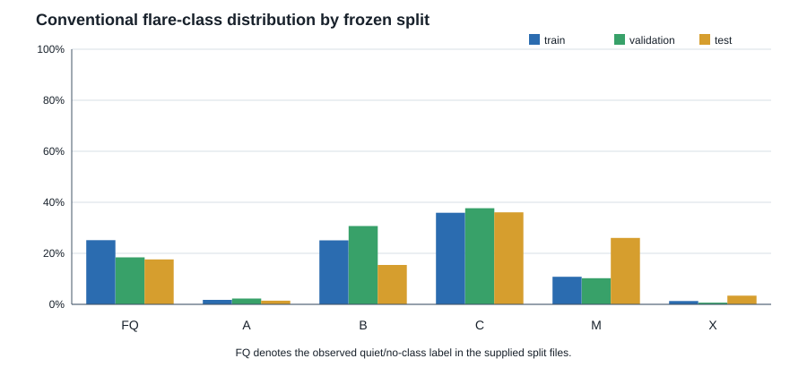
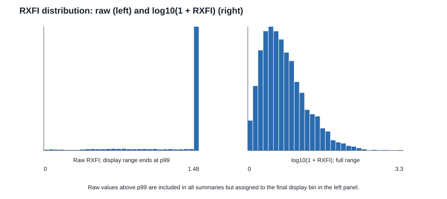
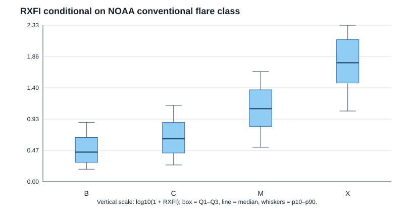

# RXFI Distribution and Conventional Flare-Class Imbalance

## Purpose

This Project-1 exploratory analysis characterizes the imbalance and tail behavior of the frozen NOAA-derived Relative X-ray Flux Increase (RXFI), and describes its relationship to conventional GOES peak-flux classes. It is not a model-training, target-binning, or split-redesign exercise.

All numbers in this note are generated by `scripts/analyze_rxfi_distribution.py` and the committed machine-readable tables in `outputs/rxfi_distribution/tables/`.

## Frozen split design and validation

The supplied split memberships were read only and were not regenerated, resampled, merged, rebalanced, or otherwise changed.

| Split | Frozen definition | Rows | Observed timestamp range | Split-rule violations |
| --- | --- | ---: | --- | ---: |
| Train | 2010-2019, Feb 15-Dec 31 | 74,760 | 2010-05-13 through 2019-12-31 | 0 |
| Validation | 2010-2019, Jan 15-Jan 31 | 3,672 | 2011-01-15 through 2019-01-31 | 0 |
| Test | 2020-2024, all dates | 43,848 | 2020-01-01 through 2024-12-31 | 0 |
| Leaky validation (diagnostic only) | 2010-2019, Jan 1-14 and Feb 1-14 | 6,048 | 2011-01-01 through 2019-02-14 | 0 |

All four files have the required `timestamp`, `max_goes_class`, and `max_intensity` fields; no value is missing in those fields and no duplicate timestamp occurs within a split. The supplied training data begin in May 2010 and the two validation-style files begin in 2011, rather than covering every date theoretically permitted by their rules. This is an availability limitation, not a membership-rule violation. Per-year counts, checksums, and field-missingness are in [split_validation_summary.csv](../../outputs/rxfi_distribution/tables/split_validation_summary.csv).

## Data matching

The split files are hourly samples with no NOAA flare-event ID, peak time, or NOAA background irradiance. They therefore cannot be joined by a supplied identifier. No pre-existing matching code was found in the repository.

For this strictly descriptive analysis, a deterministic **candidate association** was used for every non-`FQ` sample: select the unique NOAA event with the largest `xrsb_irrad` among events whose peak time lies in `[sample timestamp, sample timestamp + 24 hours)`. `FQ` is an observed quiet/no-class code in the split files and has no flare event candidate. Tied maxima are called ambiguous and not assigned RXFI. RXFI is then imported from the selected NOAA event using the frozen shared function:

\[
\operatorname{RXFI} = \frac{\texttt{xrsb\_irrad}-\texttt{background\_irrad}}{\texttt{background\_irrad}}.
\]

The 24-hour look-ahead is an explicit analysis assumption inferred from the data's `max_*` target fields and the available `*24w` data naming. It must be confirmed against the source data-generation contract before this association is used in a definitive downstream experiment.

| Split | Valid candidate RXFI | Percent of all samples | Quiet (`FQ`) | No NOAA event in candidate window | Ambiguous maxima | Invalid NOAA RXFI |
| --- | ---: | ---: | ---: | ---: | ---: | ---: |
| Train | 54,051 | 72.30% | 18,818 | 1,813 | 35 | 43 |
| Validation | 2,891 | 78.73% | 677 | 104 | 0 | 0 |
| Test | 35,156 | 80.18% | 7,721 | 931 | 40 | 0 |
| Leaky validation | 4,567 | 75.51% | 1,347 | 134 | 0 | 0 |

The candidate NOAA class differs from the supplied `max_goes_class` for 7,682 train, 487 validation, 898 test, and 664 leaky-validation matches. This is expected to be affected by the science-quality catalog's recalibration of pre-GOES-R values, but the mismatch is not resolved or corrected here. It is a material matching limitation. See [matching_summary.csv](../../outputs/rxfi_distribution/tables/matching_summary.csv).

## Conventional flare-class imbalance

The observed categories are `FQ`, `A`, `B`, `C`, `M`, and `X`; `FQ` is not a conventional GOES letter class. `C` is the largest class in every split (35.7-37.7%). Train is dominated by `C` (35.89%), `FQ` (25.17%), and `B` (25.08%), while X-class samples are only 1.31%. Test contains substantially more M- and X-class samples (26.04% and 3.41%) and fewer B-class samples (15.46%) than train, consistent with temporal distribution shift rather than a changed split definition.

Full count and percentage tables are in [flare_class_distribution.csv](../../outputs/rxfi_distribution/tables/flare_class_distribution.csv).

## RXFI distribution

Valid candidate RXFI values are strongly right-skewed. The summary below retains the complete data; no values were clipped. The raw-distribution figure limits its displayed horizontal range to p99 only to make the bulk visible, with values above that bound retained in the final bin and in all tables.

| Split | Valid n | Median | Q1-Q3 | Mean | SD | p95 | p99 | Maximum |
| --- | ---: | ---: | --- | ---: | ---: | ---: | ---: | ---: |
| Train | 54,051 | 3.82 | 1.60-9.31 | 12.60 | 53.51 | 45.41 | 149.06 | 1,993.44 |
| Validation | 2,891 | 3.92 | 1.89-9.63 | 9.45 | 18.52 | 33.68 | 59.70 | 171.38 |
| Test | 35,156 | 4.09 | 1.70-10.29 | 10.77 | 22.48 | 42.25 | 109.45 | 327.24 |
| Leaky validation | 4,567 | 3.82 | 1.71-8.98 | 10.99 | 23.96 | 49.87 | 127.25 | 206.48 |

`log10(1 + RXFI)` is reported only as a descriptive and visualization transform; it does not replace the frozen RXFI definition. Full raw and transformed quantiles (p1, p5, p10, Q1, median, Q3, p90, p95, p99) are in [rxfi_summary_by_split.csv](../../outputs/rxfi_distribution/tables/rxfi_summary_by_split.csv).

## Relationship between conventional flare class and RXFI

Candidate NOAA conventional class has a positive but incomplete monotonic association with `log10(1 + RXFI)` (Spearman rho = 0.5285, `n = 96,665` valid candidate events, with repeated hourly samples retained because split membership is immutable). Class median RXFI rises from 1.76 for B to 3.34 for C, 11.19 for M, and 57.74 for X. However, the distributions overlap substantially: B has a p10-p90 range of 0.53-6.64, C 0.77-12.62, M 2.25-42.39, and X 10.24-211.48.

This supports only the descriptive conclusion that peak-flux class does not uniquely determine relative increase above the event-specific background. It does **not** establish that RXFI is superior for forecasting or justify an RXFI label binning decision. Class-wise raw and log-transformed summaries are in [rxfi_summary_by_class.csv](../../outputs/rxfi_distribution/tables/rxfi_summary_by_class.csv).

## Temporal split comparison

The compact split table above is the split-comparison artifact. Median RXFI is similar (3.82-4.09) across train, validation, and test, while the class mix shifts materially toward M/X samples in test. Upper-tail statistics also vary (test p99 109.45 versus train p99 149.06), reinforcing that the temporal test distribution is descriptive context only and was not used to choose a transformation, threshold, or target definition.

## Proposal-ready findings

1. The supplied temporal split memberships satisfy their frozen calendar rules, with no duplicate timestamps or missing matching fields; they were not modified.
2. Conventional peak-flux labels are imbalanced, with C-class samples most common and X-class samples rare; the test period has a larger M/X share than training.
3. Candidate NOAA RXFI is markedly right-skewed, making median/IQR and log-transformed descriptive views more informative than the mean alone.
4. Higher conventional flare classes tend to have higher relative increases, but broad within-class ranges overlap; absolute peak-flux class therefore does not uniquely encode background-relative increase.
5. The current sample-to-event association is a documented 24-hour candidate rule, not a verified event identifier. Its limitations must be resolved before downstream modeling uses per-sample RXFI as ground truth.

## Limitations and open questions

- The split CSVs lack NOAA flare IDs and backgrounds. Candidate association depends on an unverified 24-hour look-ahead assumption.
- Science-quality NOAA reprocessing can change the conventional class relative to the supplied labels, especially in earlier GOES eras; no calibration reconciliation was attempted.
- Repeated hourly samples can point to the same NOAA event, so these descriptive sample-weighted distributions are not independent-event estimates.
- Extreme RXFI values are retained. Any future clipping, transforms, binning, or robust modeling choices require pre-specification and validation-only design.
- `FQ` samples do not map to a flare event and are appropriately missing RXFI under this event-level definition.
- No RXFI bins, regression/ordinal target choice, models, or test-informed decisions are made here.
